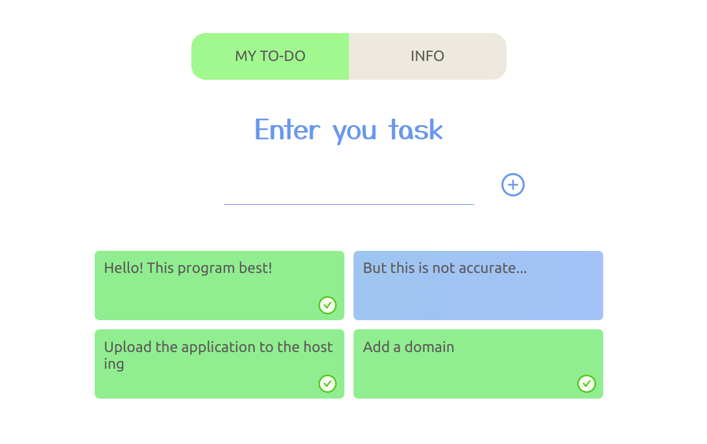
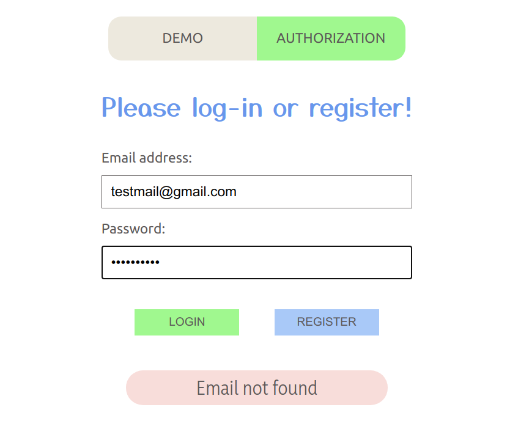

### To-do list on the React framework

A simple "to-do list" in lite style, with the ability to checked and delete completed tasks.
You can try the demo mode or use all the features of the application by logging in.

Technologies used - html, css, javascript, react, firebase, antdesign, axios, react-hook-form,
react-router-dom...

